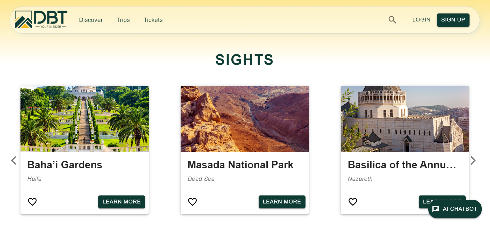

# DBT Full Stack Project

## Overview
This is a full stack web application built to showcase various tourist attractions. It includes a responsive frontend built with React and Material-UI (MUI), a Node.js/Express backend, and a PostgreSQL database hosted on Azure Cloud.

## Features
- Display a list of tourist attractions
- Delete attractions and edit user's details as an admin (CRUD operations)
- Responsive design for mobile and desktop
- AI chatbot integration using Copilot Studio
- JWT-based authentication for user sessions
- Deployed frontend on Netlify and backend on Azure/Render

## Technologies Used
- **Frontend**: React, JSX, Material-UI (MUI)
- **Backend**: Node.js, Express.js
- **Database**: PostgreSQL hosted on Azure Cloud
- **Deployment**: Frontend - Netlify, Backend - Azure/Render
- **Other Tools**: GitHub for version control

## Installation and Setup

### Prerequisites
- Node.js (v22.1.0)
- PostgreSQL
- Azure Cloud account (for database)
- Netlify or alternative deployment platform

## Usage
- Users can browse and interact with the tourist attractions and save their favorite attractions for future reference.
- The backend is connected to PostgreSQL for storing data securely.
